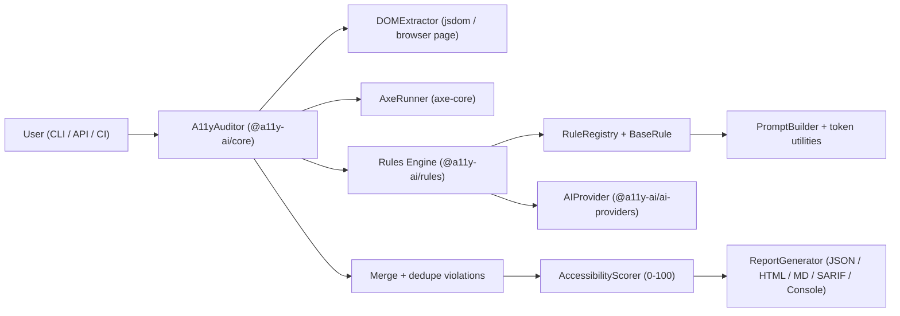
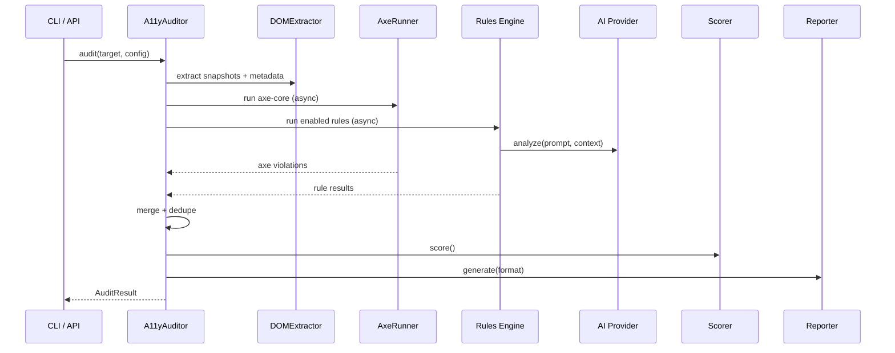

<p align="center">
  
  
  
  
  
</p>

<h1 align="center">a11y-ai</h1>

<p align="center">
  <strong>Accessibility auditing that understands your page.</strong><br/>
  Combines axe-core’s deterministic rules with LLM-powered semantic analysis<br/>
  to catch the issues static tools miss.
</p>

---

## The difference

**axe-core** checks if your `` has an `alt` attribute. **a11y-ai** checks if the alt text is _actually helpful_.

```html

```

```
axe-core  →  ✅ Pass (image has alt text)
a11y-ai   →  🔴 Serious: Alt text is a camera filename.
              Suggested fix: "Five team members standing in front of
              the company logo at the annual retreat"
              Confidence: 0.94 (requires a vision-capable provider + preset)
```

That’s the difference between checking **if** something exists and checking **if it’s actually good**.

---

## Why

[WebAIM’s “Million” study](https://webaim.org/projects/million/) consistently shows that most home pages
fail basic accessibility checks. Static tools are essential, but a lot of high-impact issues require judgment:

- Is this link text meaningful out of context?
- Does this label actually describe what the input expects?
- Does this alt text describe the image _in this page’s context_?
- Is contrast acceptable over a photo/gradient?

a11y-ai runs **axe-core first**, then layers **AI rules** on top for the semantic stuff.

---

## What it checks (today)

Built-in rules cover:

- **Alt text**: missing / empty / suspicious patterns + optional **vision** verification
- **Link text**: empty links, generic “click here”, URL-as-text, duplicate ambiguous links
- **Contrast**: computed-style contrast calculations + suggestions
- **Forms**: label association + label relevance checks
- **Structure**: heading outline, keyboard heuristics, language/readability
- **ARIA**: common misuse patterns and invalid combinations
- **Media**: captions/subtitles/transcripts heuristics for video/audio/embeds

---

## How it works (system design)



### Audit pipeline (step-by-step)



---

## Quick start (from source — works now)

This repo is a **pnpm workspace**.

```bash
corepack enable
pnpm install
pnpm build
```

### CLI (repo)

```bash
pnpm --filter @a11y-ai/cli build
node packages/cli/dist/cli.mjs audit https://example.com --preset standard --provider openai --model gpt-4o-mini
```

URL auditing requires one of the optional peer dependencies:

```bash
pnpm add -w playwright
# or
pnpm add -w puppeteer
```

### Programmatic (repo)

```ts
import { audit } from '@a11y-ai/core';

const result = await audit('https://example.com', {
  preset: 'standard',
  provider: { name: 'openai', apiKey: process.env.OPENAI_API_KEY, model: 'gpt-4o-mini' },
});

console.log(result.summary.score); // 0..100
console.log(result.mergedViolations.length);
```

---

## Quick start (from npm — once published)

> The packages are not published yet. These commands are the intended UX after publishing.

```bash
npx @a11y-ai/cli audit https://your-site.com --preset standard --provider openai --format console
```

---

## CLI usage

### Audit a URL

```bash
node packages/cli/dist/cli.mjs audit https://your-site.com \
  --preset standard \
  --provider openai \
  --model gpt-4o-mini \
  --wcag AA \
  --format html \
  --output a11y-ai-report.html
```

### Audit a local HTML file

```bash
node packages/cli/dist/cli.mjs audit ./page.html --preset quick --format console
```

### Batch auditing

```bash
# From a file (one URL per line)
node packages/cli/dist/cli.mjs audit --urls ./urls.txt

# From a sitemap
node packages/cli/dist/cli.mjs audit --sitemap https://example.com/sitemap.xml --max-pages 20

# Crawl from a starting page (treats the target as a site root)
node packages/cli/dist/cli.mjs audit https://example.com --crawl --max-pages 20
```

### Config file discovery

The CLI walks up from `cwd` and loads the first match:

- `.a11yairc.json`
- `a11y-ai.config.js`

Example `.a11yairc.json` (omit API keys and use env vars instead):

```json
{
  "preset": "standard",
  "provider": "openai",
  "model": "gpt-4o-mini",
  "wcag": "AA",
  "format": "html",
  "output": "a11y-ai-report.html",
  "threshold": 70
}
```

Environment variables supported by the CLI:

- `A11Y_AI_PROVIDER`
- `A11Y_AI_API_KEY`
- `A11Y_AI_MODEL`
- `OPENAI_API_KEY` / `ANTHROPIC_API_KEY`

---

## API

### One-liner

```ts
import { audit } from '@a11y-ai/core';

const result = await audit('https://example.com', {
  preset: 'standard',
  provider: { name: 'openai' },
});
```

### Builder pattern + progress events

Events emitted by `A11yAuditor`:

- `start(target)`
- `axe:complete(axeViolations)`
- `rule:start(ruleId)`
- `rule:complete(ruleId, results)`
- `complete(auditResult)`

```ts
import { a11yAI } from '@a11y-ai/core';

const result = await a11yAI()
  .url('https://example.com')
  .provider('openai', { apiKey: process.env.OPENAI_API_KEY, model: 'gpt-4o-mini' })
  .preset('thorough') // enables vision for supported rules/providers
  .on('rule:complete', (ruleId, results) => console.log('✓', ruleId, results.length))
  .run();
```

### Axe-only (no AI)

```ts
import { auditAxeOnly } from '@a11y-ai/core';

const violations = await auditAxeOnly('<html>...</html>', { standard: 'wcag2aa' });
```

### Batch API

```ts
import { BatchAuditor, toAuditConfig } from '@a11y-ai/core';

const batch = new BatchAuditor(toAuditConfig({ preset: 'quick' }));
const results = await batch.audit([
  'https://example.com',
  'https://example.com/about',
  'https://example.com/contact',
]);

console.log(results.summary.averageScore);
```

---

## Presets

| Preset     |     AI calls |       Vision | Use case                                        |
| ---------- | -----------: | -----------: | ----------------------------------------------- |
| `quick`    |           No |           No | Fast CI gate, free, no API key needed           |
| `standard` |          Yes |           No | Default: all built-ins with AI where applicable |
| `thorough` |          Yes |          Yes | Full audit, enables vision where supported      |
| `custom`   | Configurable | Configurable | Fine-grained control                            |

---

## Rules

9 built-in rules:

| Rule id                   | Category    | What it catches                                                          |
| ------------------------- | ----------- | ------------------------------------------------------------------------ |
| `ai/alt-text-quality`     | alt-text    | camera filenames, placeholder alt text, optional vision mismatch checks  |
| `ai/link-text-quality`    | link-text   | “click here”, bare URLs, duplicate ambiguous links                       |
| `ai/contrast-analysis`    | contrast    | low contrast based on computed styles; AI assist for complex backgrounds |
| `ai/form-label-relevance` | form-labels | missing/unclear labels and associations                                  |
| `ai/heading-structure`    | structure   | missing h1, skipped levels, outline issues                               |
| `ai/aria-validation`      | aria        | invalid/redundant/conflicting ARIA usage                                 |
| `ai/keyboard-navigation`  | structure   | tabindex traps, click handlers without keyboard access                   |
| `ai/language-readability` | structure   | missing/invalid `lang`, readability heuristics + AI notes                |
| `ai/media-accessibility`  | structure   | missing captions/subtitles/transcripts heuristics                        |

Each rule emits results with:

- **Severity**: `critical` / `serious` / `moderate` / `minor`
- **Confidence**: `0..1` (static checks tend toward `1.0`; AI is lower)
- **Source**: `static` or `ai`
- **Suggestion**: actionable remediation guidance

---

## AI providers

| Provider  | API key needed |  Vision support |   Local | Notes                                       |
| --------- | -------------: | --------------: | ------: | ------------------------------------------- |
| OpenAI    |            Yes |              ✅ |      No | good vision + structured JSON output        |
| Anthropic |            Yes |              ✅ |      No | strong reasoning                            |
| Ollama    |             No | model-dependent |      ✅ | private/local (no data leaves your machine) |
| Custom    |        depends |         depends | depends | bring your own handler                      |

The provider layer handles:

- structured JSON parsing + normalization
- retries with exponential backoff
- request timeouts (default ~30s; configurable)
- optional client-side RPM limiting

---

## Reports

| Format   | CLI flag           | Notes                                          |
| -------- | ------------------ | ---------------------------------------------- |
| Console  | `--format console` | ANSI-colored output                            |
| JSON     | `--format json`    | versioned schema (`schemaVersion: "1.0"`)      |
| HTML     | `--format html`    | single file, inline styles, dark-mode friendly |
| Markdown | `--format md`      | GitHub-friendly output                         |
| SARIF    | `--format sarif`   | GitHub Code Scanning compatible                |

---

## CI / CD

### GitHub Actions

This repo includes a composite action at `packages/github-action`.

```yaml
- name: Accessibility audit
  uses: vudayagirivaibhav/a11y-ai/packages/github-action@main
  with:
    url: https://your-site.com
    preset: standard
    provider: openai
    api-key: ${{ secrets.OPENAI_API_KEY }}
    threshold: '70'
```

---

## Repo layout

This repo is a **pnpm workspace**:

```
packages/
  core/           # @a11y-ai/core          (auditor, extraction, axe, scoring, reports)
  rules/          # @a11y-ai/rules         (rules engine + built-in rules)
  ai-providers/   # @a11y-ai/ai-providers  (OpenAI / Anthropic / Ollama / Mock / Custom)
  cli/            # @a11y-ai/cli           (CLI wrapper)
  github-action/  # @a11y-ai/github-action (composite action runner)
apps/
  playground/     # Next.js playground
```

---

## Privacy

When AI providers are enabled, **HTML snippets and element metadata** may be sent to the provider’s API.
To keep data local:

- use `--preset quick` (no AI calls)
- use `--provider ollama` (local model)
- use `--provider custom` and route via your own proxy

---

## Development

```bash
pnpm build
pnpm test
pnpm typecheck
pnpm lint
pnpm format
```

Playground:

```bash
pnpm -C apps/playground dev
```
